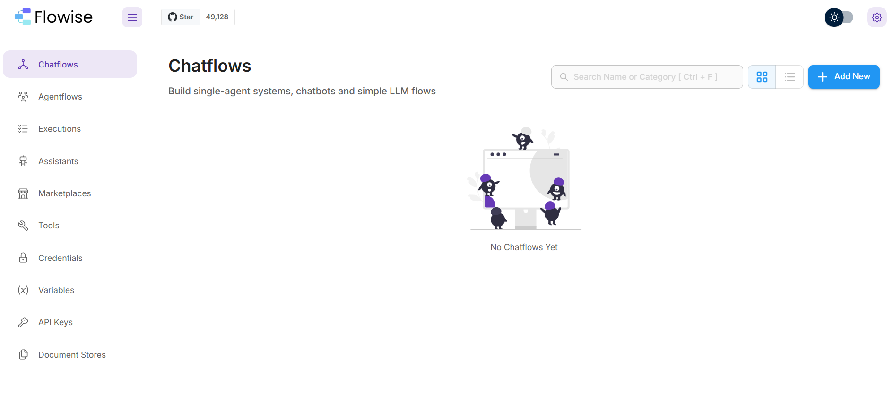
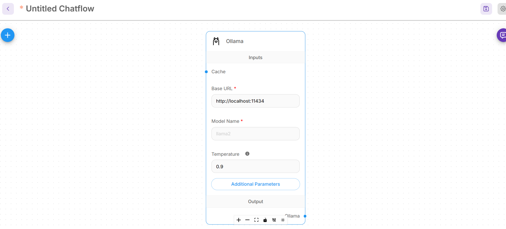
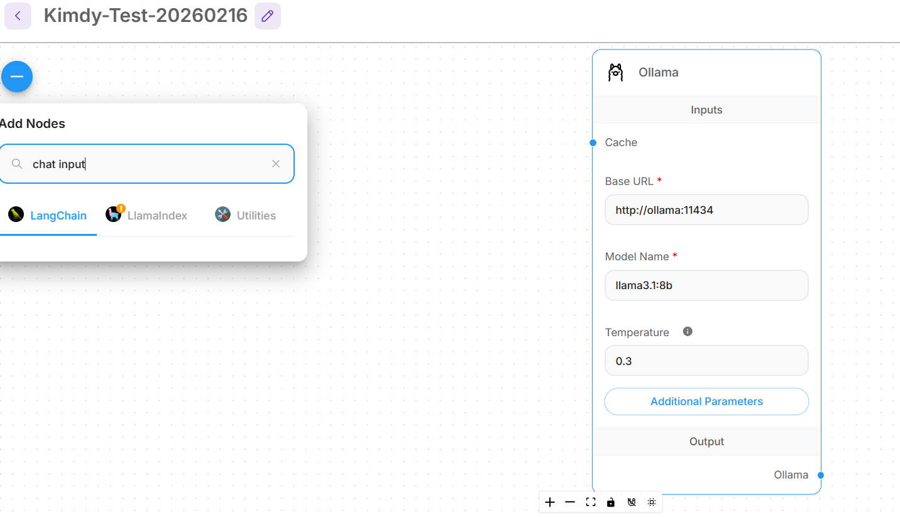
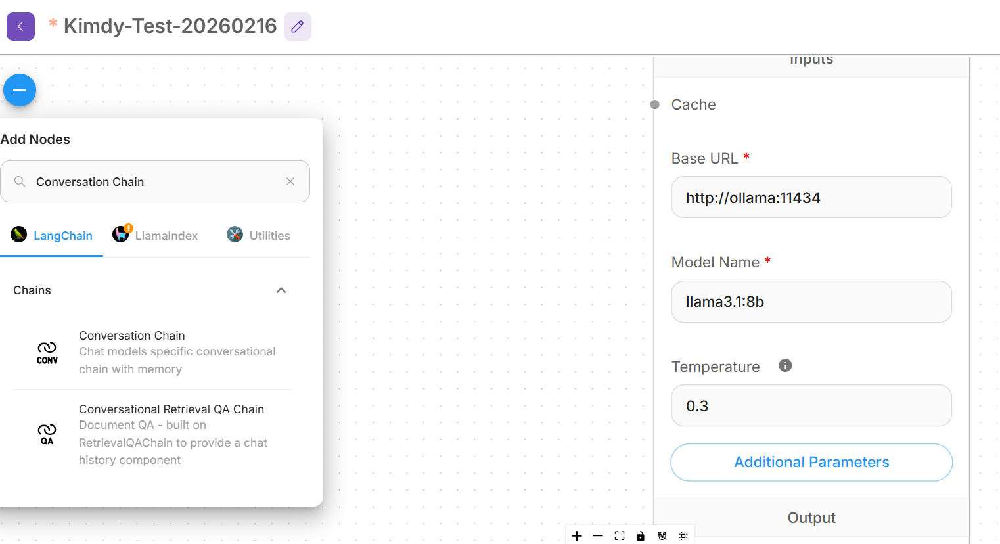
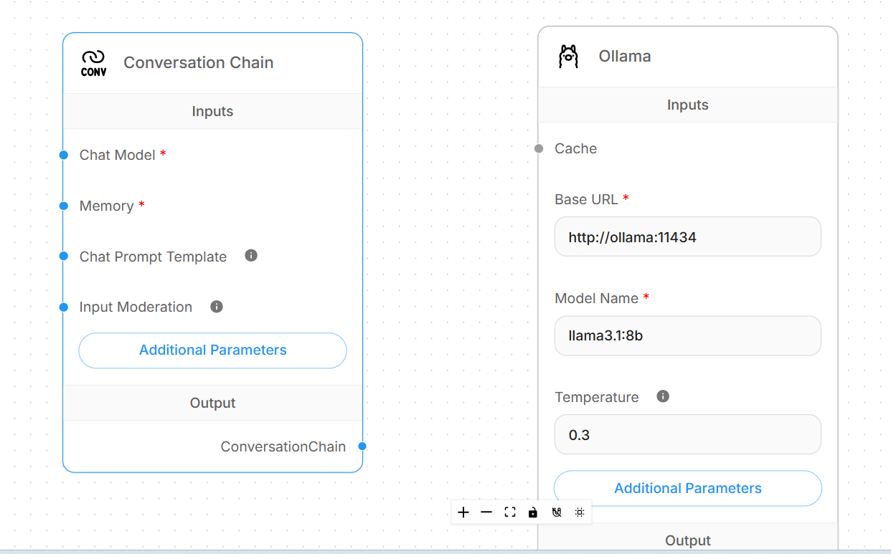
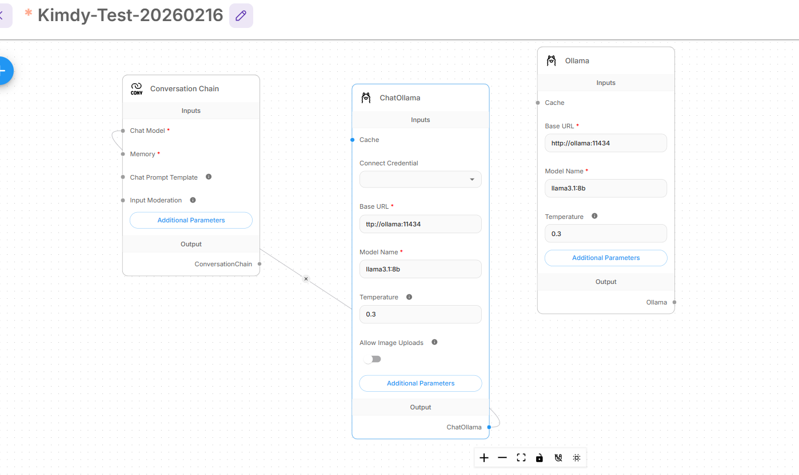
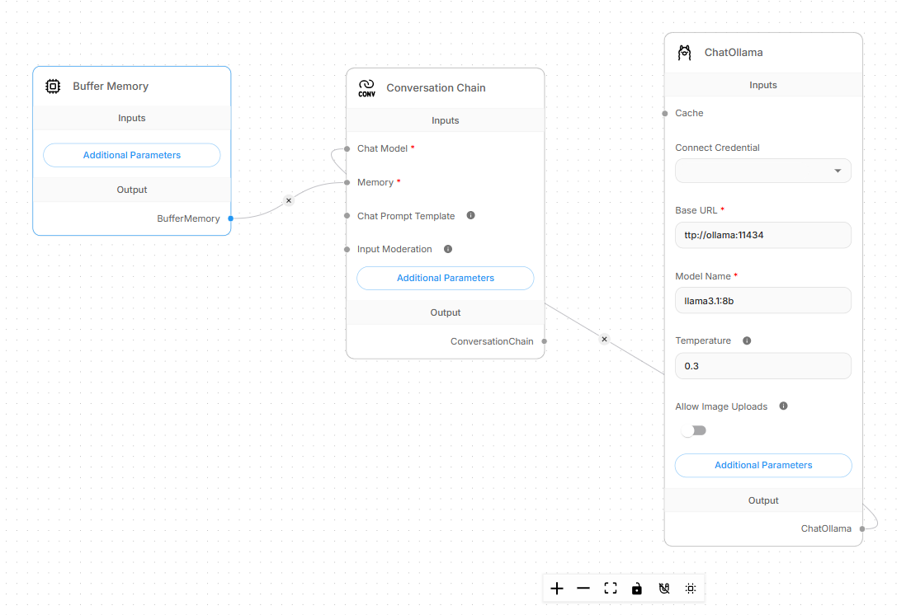
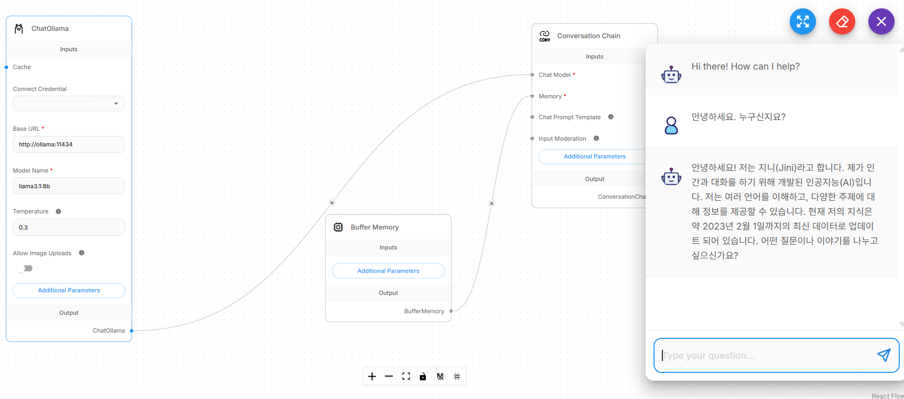
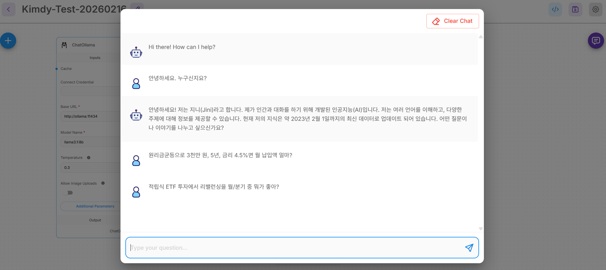

# BankRAG Enterprise Reference Repo (Flowise + LangChain JS + LlamaIndex Py)



















**목표**
- (1) 문서 업로드 API: 업로드 → 파싱 → (S3 저장) → 비동기 인덱싱
- (2) 멀티 테넌트: 부서/권한별 **Qdrant collection** 분리
- (3) 관측: 요청 로그/토큰/latency/에러 **OpenTelemetry** → Jaeger / Prometheus / Grafana
- (4) 배포: **EC2+ALB**, **ECS(Fargate)+ALB**, **Kubernetes Helm** 스켈레톤

> 도메인: 은행업 종사자(창구/여신/리스크/AML/KYC) 업무 RAG 데모 문서 포함 (`docs/banking/`)

---

## Quick Start (Docker)

### Ollama 기반 기본 설정
이 레포는 v3부터 기본 LLM/임베딩을 **Ollama 컨테이너**로 사용합니다. (`LLM_PROVIDER=ollama`)

모델은 첫 요청 시 자동 다운로드될 수 있어 느릴 수 있습니다. 미리 pull 권장:
```bash
docker exec -it bankrag-enterprise-ollama-1 ollama pull llama3.1:8b
docker exec -it bankrag-enterprise-ollama-1 ollama pull nomic-embed-text
```

---
```
docker exec -it bankrag-enterprise-ollama-1 ollama list
```
---
```
root@DESKTOP-D6A344Q:/home/AI-Flowise-RAG# docker exec -it bankrag-enterprise-ollama-1 ollama list
NAME                       ID              SIZE      MODIFIED       
nomic-embed-text:latest    0a109f422b47    274 MB    41 seconds ago    
llama3.1:8b                46e0c10c039e    4.9 GB    54 seconds ago   
```

### 1) 환경변수
```bash
cp .env.example .env
# OpenAI 사용 시 OPENAI_API_KEY 설정
# 로컬 모델(Ollama) 사용 시 OLLAMA_BASE_URL 사용
```

### 2) 실행
```bash
docker compose --env-file .env up -d --build
docker compose ps
```

접속
- **FE + API Gateway**: http://localhost:3005
- **Flowise**: http://localhost:3000
- **Qdrant**: http://localhost:6333/dashboard
- **Jaeger**: http://localhost:16686
- **Prometheus**: http://localhost:9090
- **Grafana**: http://localhost:3006 (admin / admin1234)
- **MinIO**: http://localhost:9001 (minio / minio1234)

---

## Demo Accounts
- admin / admin1234 (모든 테넌트/부서 접근)
- teller / teller1234 (branch / teller)
- risk / risk1234 (branch / risk)
- aml / aml1234 (hq / aml)

계정/권한은 `config/users.json` 에서 변경.

---

## Endpoints (Gateway)

### Auth
- `POST /api/auth/login` → `{ token }`
- `GET  /api/auth/me` → `{ user, scopes }`

### Documents
- `POST /api/documents/upload` (multipart/form-data)
  - fields: `tenant`, `dept`, `engine`(flowise|langchain|llamaindex)
  - file: `file`
  - 동작: 업로드 저장 → (옵션) MinIO(S3) 업로드 → **indexing queue**에 job enqueue
- `GET /api/documents/jobs` → 최근 job 상태

### Chat
- `POST /api/chat`
  - body: `{ question, tenant, dept, engine, topK }`
  - gateway가 권한 확인 후, 선택한 엔진으로 프록시

---

## Multi-tenant Collection Convention
Qdrant collection name:
```
bankrag__{tenant}__{dept}
```

예) `bankrag__branch__teller`, `bankrag__hq__aml`

테넌트/부서 정의: `config/tenants.yaml`

---

## Observability (OpenTelemetry)
- Node 서비스(api-gateway, indexing-worker, langchain-js): `otel/node/`
- Python 서비스(llamaindex-py): `otel/python/`
- OTel Collector: `infra/observability/otel-collector.yaml`
- 트레이스: Jaeger / 메트릭: Prometheus / 대시보드: Grafana provisioning

---

## Flowise (RAG 템플릿)
- Flowise 접속 후 `flowise/flows/bankrag-rag-template.json` import
- Qdrant / Embeddings / LLM 설정은 `.env` 와 Flowise UI에서 맞춤

---

## Deployment Skeletons
- `deploy/ec2-alb/` : Terraform + user-data placeholders
- `deploy/ecs/` : Task definition + ALB wiring placeholders
- `deploy/helm/` : Helm chart skeleton (values로 on/off)

---

## Notes (운영 팁)
- 업로드/인덱싱은 현재 **Redis(BullMQ)** 기반 비동기 처리.
- 프로덕션에서는:
  - 업로드 저장: S3(버저닝/라이프사이클)
  - 인덱싱 워커: 오토스케일(ECS/K8s HPA)
  - 권한: OIDC/SSO + RBAC(조직/직무 기반)
  - 감사로그: 문서/질의/답변 trace-id 기반 저장


---

## v2 추가 기능(운영형 확장)

### A) 실 파일 파싱 (PDF/DOCX/TXT/MD)
- **LangChain(JS)**: `pdf-parse`, `mammoth` 적용
- **LlamaIndex(Python)**: `PyMuPDF(fitz)`, `python-docx` 적용

> PDF는 스캔 이미지 기반이면 텍스트가 없을 수 있습니다. 그 경우 OCR 파이프라인(예: Tesseract/Document AI)을 별도 단계로 추가하세요.

### B) 문서 레지스트리(버전관리) + 삭제 API
- 업로드 시 `docId` 발급, 동일 이름은 `version` 자동 증가
- 레지스트리 저장: `apps/api-gateway/data/registry/*.json`
- 삭제(soft delete): 레지스트리 tombstone + Qdrant points 삭제

Endpoints 추가:
- `GET  /api/documents/list?tenant=...&dept=...`
- `GET  /api/documents/versions?docId=...`
- `POST /api/documents/delete` body: `{ tenant, dept, docId }`

### C) 감사로그(Audit) + Trace 연계
- 모든 API 요청에 대해 JSONL 감사로그를 남김:
  - 경로: `apps/api-gateway/data/audit/audit.log`
  - 포함: user, tenant/dept(가능 시), status, latencyMs, traceparent

### D) Flowise 템플릿(가이드 + 샘플)
- `flowise/flows/`에 **채팅용 RAG**, **인덱싱용(업로드→분할→업서트)** 플로우 템플릿 **예시(JSON)** 및
  **Flowise UI에서 재구성하는 체크리스트**를 제공합니다.
- Flowise Export JSON 포맷은 버전에 따라 변화가 있어, 템플릿은 "구성 요소/노드 체크리스트 + 예시" 형태로 제공합니다.

---
```
cd /home/AI-Flowise-RAG
cp .env.example .env

# 이미지 받기
docker compose --env-file .env pull

# 기동
docker compose --env-file .env up -d --build

# 모델 미리 받기 (이제 무조건 이 방식 권장)
docker compose --env-file .env exec ollama ollama pull llama3.1:8b
docker compose --env-file .env exec ollama ollama pull nomic-embed-text

# 상태 확인
docker compose ps
curl http://localhost:11434/api/tags | head
```

